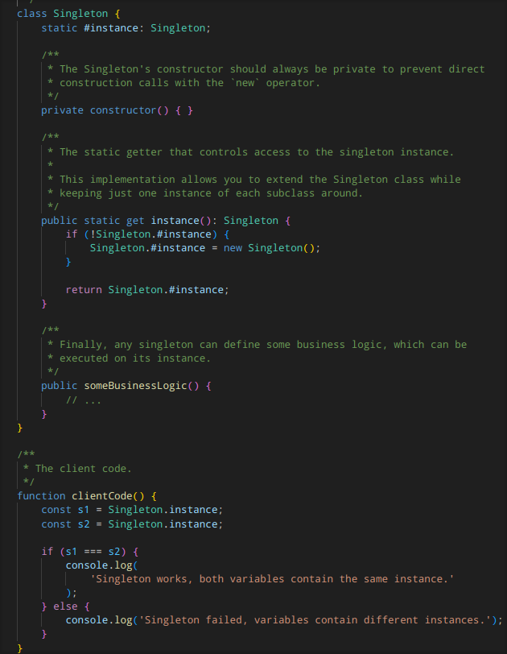

# padroes_de_projeto_es

# Padrões de Projeto 

**Atenção**: Este texto contém uma tradução livre dos artigos publicados do site Refactoring Guru, que contém os códigos e as explicações originadas em inglês.

Os Padrões de Projeto (ou Design Patterns, em inglês) são soluções típicas para os problemas comuns em design de software. Dentro desta área, existem três tipos de padrões de projeto:

- **Criacionais**: São padrões que fornecem vários mecanismos de criação de objetos, que aumentam a flexibilidade e a reutilização do código existente;

- **Estruturais**: São padrões que servem para estudar o comportamento ou método de um objeto e como este objeto pode se unir em estruturas maiores, enquanto mantém as estruturas flexíveis e eficientes;

- **Comportamentais**: São padrões que estão preocupados com os algoritmos e com a atribuição de responsabilidades entre os objetos, portanto eles estudam o comportamento ou método de um objeto.

## Padrão de Projeto Criacional: Singleton

O **Singleton** é um padrão de projeto criacional que permite a você garantir que uma classe tenha apenas uma instância, enquanto fornece um ponto de acesso global para essa instância.

### Problemas e Solução
O Singleton serve para solucionar dois problemas, ao passo que ela viola o Príncipio de Responsabilidade Única do SOLID:

1. Garante que uma classe tenha apenas uma única instância, sendo dispensável a utilização de inúmeras instâncias de uma mesma classe;

2. Fornece um ponto de acesso global para essa instância, o que mantém ela seguro dela ser reescrita por um outro código.

Para isso, as implementações do Singleton tem dois passos em comum:

- Faz o construtor padrão da classe private, previnindo outros objetos de usar o operador ```new``` com a classe Singleton;
- Cria um método de criação estático que age como um construtor. Por baixo dos panos, este método chama o construtor privado para criar um objeto e o salva no campo estático. As chamadas posteriores para este método retornam o objeto instânciado.

### Estrutura
 <br />
Nesta estrutura, a classe Singleton declara o método estático ```getInstance``` que retorna a instância da própria classe. Dessa forma, o construtor deveria estar escondido do código tradicional, sendo o método a única forma de se obter o objeto Singleton.

### Exemplo de código
 <br />
Neste exemplo de código em TypeScript (TS), a classe Singleton cria uma instância estática do objeto Singleton, dessa forma, mantém o construtor da classe privado e a obtenção da instância pública, que faz uma condicional em que se a instância não existir, deve criar uma instância nova a partir do construtor. Após definir algumas lógicas para o código, a instância é retornada para a função, em que neste exemplo, é criado duas variáveis para garantir as duas possuam a mesma instância com as mesmas variáveis, retornando no final:

```Singleton works, both variables contain the same instance.```

## Padrão de Projeto Estrutural: Facade

O **Facade** é um padrão de projeto estrutural que fornece uma interface simplificada para uma biblioteca, um _framework_, ou qualquer outro conjunto complexo de classes

### Problema e Solução

Imagine que você deve fazer o seu código funcionar com um amplo conjunto de objetos que pertence a um _framework_ ou uma biblioteca sotisficada. Normalmente, você precisaria iniciar todos os objetos, manter o caminho das dependências, executar os métodos à risca, e assim por diante. Como resultado, a lógica de negócio da sua classe se tornaria fortemente acoplada com os detalhes da implementação das classes de terceiros, fazendo com que seja difícil de manter e compreender.

Como solução, um **Facade**, ou fechada, é uma classe que fornece uma interface simples para subsistemas complexos que contém inúmeras partes. Ela proverá funcionalidade limitada em comparação com o subsistema diretamente, entretanto, ela incluirá apenas as funções que o usuário realmente se importa para o seu programa.

Portanto, tendo um Facade é útil quando você precisa integrar o seu aplicativo com uma biblioteca sotisficada que contém dezenas de funcionalidades, mas você vai precisar de apenas algumas delas para o seu programa.

### Estrutura
 <br />
Nesta estrutura:

1. A **Facade** fornece acesso para uma parte específica da funcionalidade do subsistema, sabendo onde direcionar o pedido do usuário e como operar todas as partes móveis;

2. Pode ser criado uma **Facade adicional** para previnir de poluir uma única facade com funções não relacionáveis que podem fazer outra estrutura complexa. Estas facades adicionais podem ser usados tanto pelo usuário quanto por outras facades;

3. O subsistema complexo consiste em dezenas de vários objetos. Para fazer com que eles sejam funções significativas, você precisa se aprofundar nos detalhes da implementação do subsistema, tais como os objetos inicializadores na ordem correta e complementando eles com as informações no devido formato. É importante dizer que as classes do subsistema não sabem da existência das facades;

4. O cliente (ou usuário) usa a facade ao invés de chamar o subsistema diretamente.

### Exemplo de código

No código que está presente na pasta Facade e escrita em TypeScript (TS), a classe Facade cria os objetos protegidos de dois subsistemas que realiza a construção, e posteriormente, os métodos da Facade são atalhos para as funcionalidades mais sotisficadas dos subsistemas. O subsistema, pode aceitar os pedidos tanto do cliente diretamente quanto da Facade. Em qualquer caso, a Facade é outro cliente, e não parte do subsistema.

## Padrão de Projeto Comportamental: Observer

O Observer, ou Observador, é um padrão de projeto comportamental que permite que você defina um mecanismo de inscrição para notificar múltiplos objetos sobre qualquer evento que aconteça no objeto que eles estão observando.

### Problema e Solução

Imagine que você tenha dois tipos de objeto: um ```Cliente``` e uma ```Loja```. O cliente é interessado em uma marca de um produto específico, que deveria estar disponível na loja em breve. O cliente então poderia visitar a lojar todo dia e checar a disponibilidade do produto, entretanto, a maioria dessas viagens podem ser sem sentido, uma vez que o cliente precisaria fazer a mesma rota todo dia até que o produto chegasse, demandando tempo, logística para ir a loja, dentre outros fatores.

Por outro lado, a loja poderia enviar milhares de emails (que podem ser considerados como spam) para todos os consumidores toda vez que um novo produto esteja disponível. Isso pode economizar tempo para os consumidores, mas poderia também aborrece-los que não estão inressados nos novos produtos. Dessa forma, poderemos ter um conflito em ambos os lados.

Portanto, para que tanto o cliente quanto a loja cheguem a um acordo, o Observer sugere que você adicione um mecanismo de inscrição para a classe publicadora, então objetos individuais podem se inscrever ou desincrever de um fluxo de eventos desta publicadora. Portanto, sempre que um evento importante acontece na publicadora, isso vai ser notificado para os inscritos interessados nas publicações.

### Estrutura
 <br />

Nesta estrutura:
1. A publicadora publica os eventos de interesse para outros objetos. Estes eventos ocorrem quando a _publisher_ muda o seu estado ou executa alguns comportamentos. As publicadores contém uma infraestrutura que permite aos novos inscritos a se juntarem e os inscritos atuais deixam a lista de inscrição;

2. Quando um novo evento acontece, a publicadora vai até a lista de inscrição e chama o método da notificação declarada na interface do inscrito em cada objeto do inscrito;

3. A interface do inscrito declara a interface de notificaçao. Na maioria dos casos, consiste em um único método chamado ```update```. O método pode ter diversos parâmetros que permitem a publicadora passar os detalhes de alguns eventos junto da atualização;

4. Os inscritos concretos performam algumas ações em respostas as notificações publicadas pela publicadora. Todas estas classes devem implementar a mesma interface, então a publicadora não é acoplada com as classes concretas;

5. Normalmente, os inscritos precisam de algumas informações contextuais para lidar com a atualização corretamente. Por esta razão, as publicadoras passam informações de contexto frequemente como argumentos do método da notificação;

6. O cliente cria os objetos da publicadora e do inscrito separadamente e então registra os inscritos para as atualizações da publicadora.
